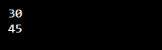
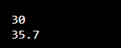
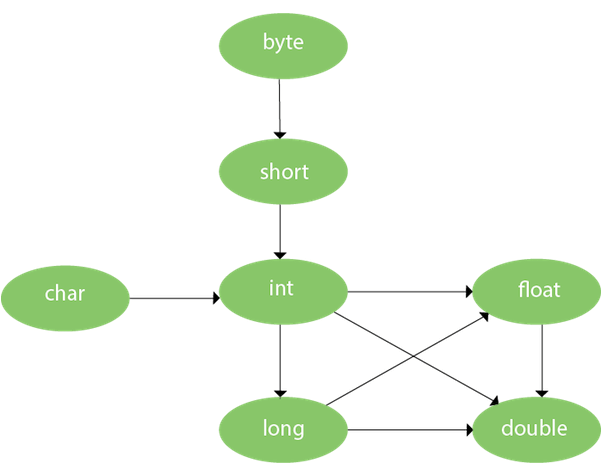

## OVERLOADING DAN INHERITANCE </p>
## METHOD OVERLOADING DI JAVA </p>
Jika suatu kelas memiliki beberapa metode yang memiliki nama yang sama tetapi parameternya berbeda, ini dikenal sebagai Metode Overloading. </p>
Jika kita harus melakukan hanya satu operasi, memiliki nama metode yang sama akan meningkatkan keterbacaan program. Misalkan Anda harus melakukan penambahan angka yang diberikan tetapi bisa ada sejumlah argumen, jika Anda menulis metode seperti a(int,int) untuk dua parameter, dan b(int,int,int) untuk tiga parameter maka itu mungkin sulit bagi Anda serta programmer lain untuk memahami perilaku metode karena namanya berbeda. </p>

<b> Keuntungan dari metode overloading </b></p>
Metode overloading meningkatkan keterbacaan program. <p>
Ada dua cara untuk membebani metode di java: </p>
1. Dengan mengubah jumlah argumen; </p>
2. Dengan mengubah tipe data. </p>

# 1) Method Overloading: mengubah no. argumen. </p>
Dalam contoh ini, kami telah membuat dua metode, metode add() pertama melakukan penjumlahan dua angka dan metode add kedua melakukan penambahan tiga angka. </p>

```java
class Belajar{  
static int add(int a,int b){return a+b;}  
static int add(int a,int b,int c){return a+b+c;}  
}  
class Overloading1{  
public static void main(String[] args){  
System.out.println(Belajar.add(15,15));  
System.out.println(Belajar.add(15,15,15));  
}}  

```
</p>

<b> Output: </b></p>

</p>

# 2) Metode Overloading: mengubah tipe data argumen. </p>
Dalam contoh ini, kami telah membuat dua metode yang berbeda dalam tipe data. Metode tambah pertama menerima dua argumen integer dan metode tambah kedua menerima dua argumen ganda. </p>

```java

class Belajar{  
static int add(int a, int b){return a+b;}  
static double add(double a, double b){return a+b;}  
}  
class Overloading2{  
public static void main(String[] args){  
System.out.println(Belajar.add(15,15));  
System.out.println(Belajar.add(23.4,12.3));  
}}  

```
</p>
<b> Output: </b></p>

</p>

## Metode Overloading dan Jenis Promosi </p>
Satu tipe dipromosikan ke tipe lain secara implisit jika tidak ditemukan tipe data yang cocok. Mari kita memahami konsep dengan gambar yang diberikan di bawah ini:</p>

</p>

