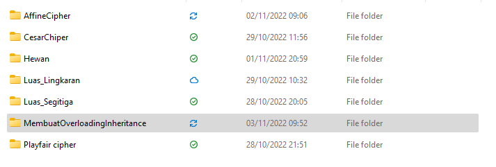
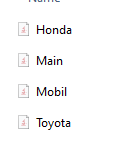
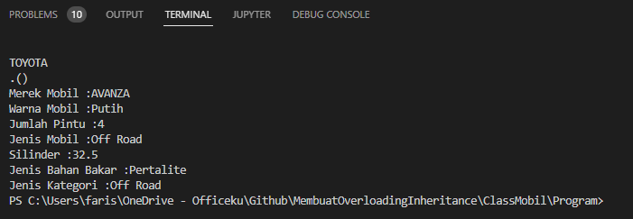

## OVERLOADING DAN INHERITANCE </p>
## METHOD OVERLOADING DI JAVA </p>

<b> Pengertian Method Overloading </b> </p>
Jika suatu kelas memiliki beberapa metode yang memiliki nama yang sama tetapi parameternya berbeda, ini dikenal sebagai Metode Overloading. Di dalam bahasa Java, method overloading adalah membuat beberapa method dengan nama yang sama, tapi dibedakan dari jumlah dan/atau tipe parameter. </p>

Seharusnya, kita tidak bisa membuat method dengan nama yang sama. Mirip seperti penamaan variabel, compiler Java akan error jika menemukan 2 atau lebih method dengan nama yang sama. Akan tetapi jika jumlah argument dan/atau tipe data argument berbeda, maka akan dianggap sebagai method yang berbeda pula. </p>

Method overloading bisa saja terjadi dalam satu class yang sama, dan bisa juga dari class turunan.
Jika kita harus melakukan hanya satu operasi, memiliki nama metode yang sama akan meningkatkan keterbacaan program. Misalkan Anda harus melakukan penambahan angka yang diberikan tetapi bisa ada sejumlah argumen, jika Anda menulis metode seperti a(int,int) untuk dua parameter, dan b(int,int,int) untuk tiga parameter maka itu mungkin sulit bagi Anda serta programmer lain untuk memahami perilaku metode karena namanya berbeda. </p>

<b> Keuntungan dari metode overloading </b></p>
Metode overloading meningkatkan keterbacaan program. <p>
Ada dua cara untuk membebani metode di java: </p>
1. Dengan mengubah jumlah argumen; </p>
2. Dengan mengubah tipe data. </p>

# 1) Method Overloading: mengubah no. argumen. </p>
Dalam contoh ini, kami telah membuat dua metode, metode add() pertama melakukan penjumlahan dua angka dan metode add kedua melakukan penambahan tiga angka. </p>

```java
class Belajar{  
static int add(int a,int b){return a+b;}  
static int add(int a,int b,int c){return a+b+c;}  
}  
class Overloading1{  
public static void main(String[] args){  
System.out.println(Belajar.add(15,15));  
System.out.println(Belajar.add(15,15,15));  
}}  

```
</p>

<b> Output: </b></p>

</p>

# 2) Metode Overloading: mengubah tipe data argumen. </p>
Dalam contoh ini, kami telah membuat dua metode yang berbeda dalam tipe data. Metode tambah pertama menerima dua argumen integer dan metode tambah kedua menerima dua argumen ganda. </p>

```java

class Belajar{  
static int add(int a, int b){return a+b;}  
static double add(double a, double b){return a+b;}  
}  
class Overloading2{  
public static void main(String[] args){  
System.out.println(Belajar.add(15,15));  
System.out.println(Belajar.add(23.4,12.3));  
}}  

```
</p>
<b> Output: </b></p>

</p>

## Metode Overloading dan Jenis Promosi </p>
Satu tipe dipromosikan ke tipe lain secara implisit jika tidak ditemukan tipe data yang cocok. Mari kita memahami konsep dengan gambar yang diberikan di bawah ini:</p>

</p>

## Inheritance Di Java
<b> Pengertian Inheritance </b> </p>
Inheritance di Java adalah konsep yang memperoleh properti dari satu kelas ke kelas lain; misalnya hubungan antara ayah dan anak. Warisan di Jawa adalah proses memperoleh semua perilaku dari objek induk. Konsep pewarisan di Java adalah bahwa kelas baru dapat dibangun di atas kelas yang lebih lama. Anda dapat menggunakan metode dan properti kelas induk saat mewarisi dari kelas yang sudah ada. Anda juga dapat menambahkan bidang dan metode tambahan ke kelas yang ada.
Hubungan orang tua-anak, juga dikenal sebagai hubungan IS-A, diwakili oleh pewarisan. </p>

Untuk menjelaskan lebih lanjut, Satu objek dapat memperoleh semua properti dan tindakan objek induk melalui teknik pewarisan dalam Pemrograman Java. Ini adalah komponen penting dari OOP (sistem pemrograman Berorientasi Objek). Di Java, ide pewarisan berarti bahwa kelas baru dapat dibangun di atas kelas yang sudah ada. Ketika Anda berasal dari kelas yang ada, Anda dapat menggunakan metode dan propertinya. Untuk kelas Anda saat ini, Anda juga dapat menambahkan bidang dan metode baru. </p>

<b> Apa yang dimaksud dengan Inheritance dan contohnya? </b> </p>
Item baru dapat mewarisi sifat-sifat objek lama melalui proses pewarisan. Sebagai ilustrasi, pikirkan kelas ”manusia”. Anda mungkin ingin menambahkan karakteristik manusia lainnya di kelas Anda, seperti tinggi, berat, dan sebagainya. Oleh karena itu, satu pendekatan adalah mendefinisikan ulang setiap atribut tersebut di kelas Anda. Meskipun bukan praktik yang baik, ini mungkin merupakan pendekatan yang berguna untuk mempelajari pemrograman berorientasi objek. Mewarisi semua properti itu dari satu kelas tertentu adalah cara terbaik untuk melakukannya. Semua atribut kelas "manusia" (atau "orang tua") dapat diwarisi oleh kelas "anak". Istilah "warisan" dalam pemrograman berorientasi objek mengacu pada ini. </p>

```java
Class PetAnimal {

  // field and method of the parent class
  String name;
  public void eat() {
    System.out.println("I can eat");
  }
}

// inherit from PetAnimal
class Dog extends PetAnimal {

  // new method in subclass
  public void display() {
    System.out.println("My name is " + name);
  }
}

class Main {
  public static void main(String[] args) {

    // create an object of the subclass
    Dog labrador = new Dog();

    // access field of superclass
    labrador.name = "Rohu";
    labrador.display();

    // call method of superclass
    // using object of subclass
    labrador.eat();

  }
}

```
</p>
Di Java, sebuah kelas dapat mewarisi atribut dan metode dari kelas lain. Kelas yang mewarisi properti dikenal sebagai sub-kelas atau kelas anak. Kelas dari mana properti diwarisi dikenal sebagai superclass atau kelas induk. </p>

Dalam Warisan, properti dari kelas dasar diperoleh oleh kelas turunan. </p>

<b> Sintaks Inheritance Java </b> </p>

```java
class derived_class extends base_class  
{  
   //methods 
   //fields
} 

```
</p>

<b> Format umum untuk Inheritance </b></p>

```java
class​ superclass 
{ 
 // superclass data variables 
 // superclass member functions 
} 
class​ subclass ​extends​ superclass 
{ 
 // subclass data variables 
 // subclass member functions 
}
``` 
</p>

Inheritance menggunakan kata kunci “extends” untuk membuat kelas turunan dengan menggunakan kembali kode kelas dasar. </p>

<b> Mengapa menggunakan Inheritance di Java? </b> </p>
Keuntungan utama dari pewarisan adalah dapat digunakan kembali kode dan juga metode overriding (polimorfisme runtime). Inheritance juga dikenal sebagai hubungan IS-A. </p>

<b> Istilah yang Digunakan dalam Inheritance. </b></p>
<li>Kelas: Kelas adalah kumpulan objek yang memiliki properti umum.</li></p>
<li>Kelas Turunan/Sub-kelas: Kelas turunan adalah kelas yang mewarisi dari kelas dasar. Hal ini juga dikenal sebagai subclass atau kelas anak.</li></p>
<li>Kelas Dasar/Superclass: Kelas dasar adalah kelas utama tempat kelas turunan mewarisi fitur. Hal ini juga dikenal sebagai superclass atau kelas induk.</li></p>
<li>Dapat digunakan kembali: Nama itu sendiri mengatakan gunakan kembali kode yang berulang dalam program. Ini adalah mekanisme untuk menggunakan kembali kode yang ada saat Anda membuat kelas baru.
</li></p>

Tidak mungkin menulis program java tanpa menggunakan warisan. Meningkatkan keterampilan Java Anda dengan mengambil kursus sertifikat akan membantu Anda maju dalam karir Anda. Kursus sertifikat gratis pemrograman java ini mencakup dasar-dasar subjek, termasuk Array dan Fungsi, dan dapat membantu mendapatkan kejelasan yang luar biasa dan membangun fondasi yang kuat. </p>

## PROGRAM OVERLOADING DAN INHERITANCE DI JAVA. </P>
<b>1. Kita buat folder didalam dokumen. disini saya kasih nama foldernya "MembuatOverloadingInheritance".</b></p>

</p>

<b>2. Selanjutnya, didalam folder "MembuatOverloadingInheritance" kita buat 4 file yaitu: "Mobil.java, Honda.java, Toyota.java dan Main.java". </b></p>

</p>

<b>3. Selanjutnya, didalam file Mobil.java kita isi kodingannya: </b></p>

```java

public class Mobil {
    private String merek;
    private String warna;
    private int  jumlah_pintu;
    private String jenis;

    //Ini adalah Get dan Overloading
    public String getMerek(){
        return merek;
    }
    //Ini adalah Set dan Overloading
    public void setMerek(String merek){
        this.merek=merek;
    }

    public String getWarna(){
        return warna;
    }

    public void setWarna(String warna){
        this.warna=warna;
    }

    public int getJumlah_pintu(){
        return jumlah_pintu;
    }

    public void setJumlah_pintu(int jumlah_pintu){
        this.jumlah_pintu=jumlah_pintu;
    }

    public String getJenis(){
        return jenis;
    }

    public void setJenis(String jenis){
        this.jenis=jenis;
    }

    public void tampilkandata(){
        System.out.println(".()");
        System.out.println("Merek Mobil :"+getMerek());
        System.out.println("Warna Mobil :"+getWarna());
        System.out.println("Jumlah Pintu :"+getJumlah_pintu());
        System.out.println("Jenis Mobil :"+getJenis());
    }

    public void inputdata(String merek, String warna, int jumlah_pintu, String jenis){
        setMerek(merek);
        setWarna(warna);
        setJumlah_pintu(jumlah_pintu);
        setJenis(jenis);
    }


}

```
</p>
<b>4. Selanjutnya, didalam file Honda.java kita isi kodingannya: </b></p>

```java
public class Honda extends Mobil{
/**
 * 
 */
public void tampilkan(){
    double besar_silinder = 5.5;
    String bahan_bakar = "Pertamax";
    String kategori = "Sport";

    Mobil m = new Mobil();

    m.inputdata("CRV", "Merah", 4, "Mewah");
    m.tampilkandata();

    System.out.println("Silinder :"+besar_silinder);
    System.out.println("Jenis Bahan Bakar :"+bahan_bakar);
    System.out.println("Jenis Kategori :"+kategori);
  
}
}

```
</p>

<b>5. Selanjutnya, didalam file Toyota.java kita isi kodingannya: </b></p>

```java
public class Toyota extends Mobil {
    public void tampilkan(){
        double besar_silinder;
        String bahan_bakar;
        String kategori;

        besar_silinder=32.5;
        bahan_bakar="Pertalite";
        kategori="Off Road";
    
        Mobil m = new Mobil();
    
        m.inputdata("AVANZA", "Putih", 4, "Off Road");
        m.tampilkandata();
    
        System.out.println("Silinder :"+besar_silinder);
        System.out.println("Jenis Bahan Bakar :"+bahan_bakar);
        System.out.println("Jenis Kategori :"+kategori);
      
    }
    
}
```
</p>
<b>5. Selanjutnya, didalam file Main.java kita isi kodingannya: </b></p>

```java
public class Main {
public static void main(String[] args) {
    System.out.println("HONDA");
    Honda h = new Honda();
    h.tampilkan();

    System.out.println("\nTOYOTA");
    Toyota t = new Toyota();
    t.tampilkan();
}


}
```
<b> Fungsi dari file Main.java adalah untuk menjalankan program dari class mobil. Setelah itu kita RUN programnya di file Main.java.</b></p>

## Output Program: </p>

</p>


